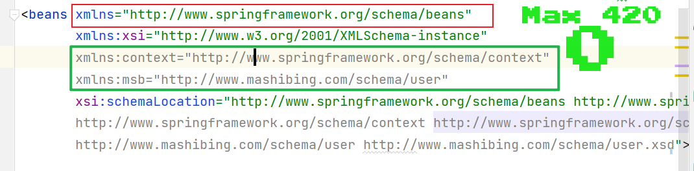
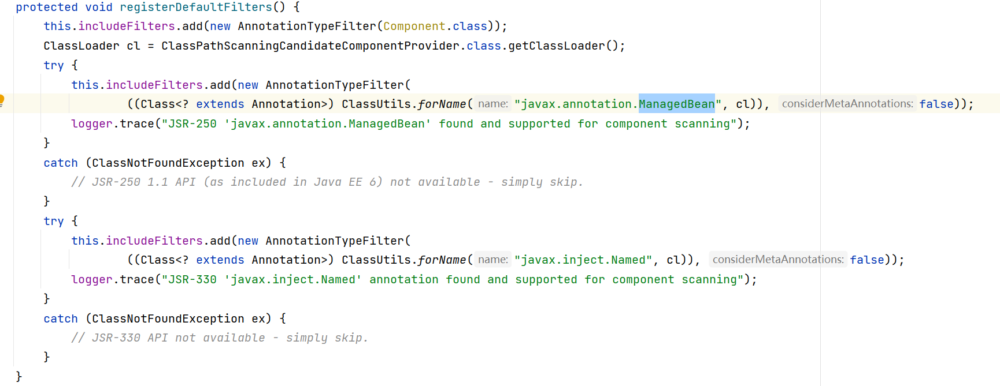
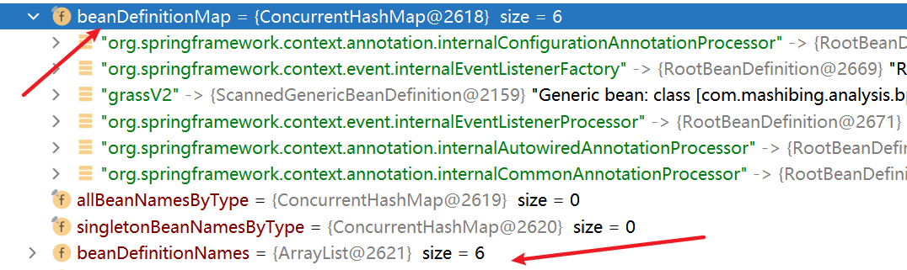

# 一、引言
  spring中，BeanDefinition是其控制反转（IOC）和切面代理（AOP）依托的核心基础。不管是配置文件中的类对象还是在此基础上的
注解标注的类，其本质都是解析成BeanDefinition，然后完成一系列的实例化，初始化，属性填充等处理。
# 二、配置类的解析
  测试验证类： com.mashibing.analysis.bpparse.TestBPParse
  在配置文件中，我们知道标签<beans>，该标签是我们一切解析工作的前提，spring官方将其成为命名空间。命名空间分为默认命名空间
和自定义命名空间，默认命名空间有且仅有一个http://www.springframework.org/schema/beans ，除此之外均为自定义的命名空间。

| #    | 命名空间类别   | 核心标签                                                     |
| ---- | -------------- | ------------------------------------------------------------ |
| 1    | 默认命名空间   | <bean>,<import>                                              |
| 2    | 自定义命名空间 | <context :component-scan/>, <context: property-placeholder/>,<aop :aspectj-autoproxy/> |

  在后续的obtainFreshBeanFactory()核心方法中，AbstractXmlApplicationContext#loadBeanDefinitions将会设置
EntityResolver对象，EntityResolver对象创建的过程中会指定对应的META-INF/spring.schemas配置文件（也就是
PluggableSchemaResolver）, 在此基础上，我们会完成配置文件中的约束的提示和规范化。之后，将进入真正的解析工作
（XmlBeanDefinitionReader#doLoadBeanDefinitions），通过doLoadDocument方法将会将其解析为一个一个我们需要的
Document对象（java.sax.xml底层实现，该部分不用了解）。
  以上准备工作完成后，调用DefaultBeanDefinitionDocumentReader#doRegisterBeanDefinitions方法开始对文档对象进行封装
注册处理。
  对于默认的命名空间，http://www.springframework.org/schema/beans 仅仅只是一个标识作用，我们可以按照自己的想法随意修改
，比如BeanDefinitionParserDelegate#BEANS_NAMESPACE_URI常量/spring-beans.xsd/xml配置中beans的xmlns做出相同的修改
即可完成beanDefinition的注入。换言之，在默认的命名空间中spring.handlers是没有配置对应的NamespaceHandler处理器的。在
spring.schemas中配置了对应的约束后文件spring-beans.xsd后，所有的解析工作都是通过BeanDefinitionParserDelegate解析委托
工作来完成的。
  与之相反，自定义的命名空间在满足基本的约束文件的配置完成基本的Document对象的解析工作后，后续的BeanDefinition解析将依靠命
名空间获取到对应NamespaceHandler处理器，从而根据标签信息获取到NamespaceHandler中初始化的解析器完成处理工作。比如，
<msb: user>标签，msb可以获取到命名空间从而得到NamespaceHandler处理器，而user则可以获取到对应的解析器。

# 三、注解类的解析
  测试验证类:    com.mashibing.analysis.bpparse.TestBPParseV2
  被扫描到的前提: 使用的注解为@Component或者注解类或其父类上含有@Component才可被扫描到, 从而创建为BeanDefinition。
  注解类的解析依托于配置类解析的自定义命名空间，注解被扫描到的前提就是开启<context: component-scan/>。当开启后，
ContextNamespaceHandler被加载，并获取到组件扫描解析器ComponentScanBeanDefinitionParser。在其执行过程中，根据
component-scan配置文件信息，调用configureScanner方法创建一个ClassPathBeanDefinitionScanner扫描器，特别注意的是，在构造
是默认调用registerDefaultFilters注册了能被识别到的注解。在其doScan方法中调用findCandidateComponents找到满足其配置条件的
BeanDefinition, ClassPathScanningCandidateComponentProvider#isCandidateComponent判断读取到的包下的资源是否是候选的
组件并注册到容器，最终返回一个ScannedGenericBeanDefinition的set集合。最后，紧接着调用
ComponentScanBeanDefinitionParser#registerComponents方法中，如果其配置了注解，调用
AnnotationConfigUtils#registerAnnotationConfigProcessors注册一些内部类，其中最重要的为
ConfigurationClassPostProcessor。
  至此，注解类完全解析为BeanDefinition并注册到容器中的beanDefinitionMap和beanDefinitionNames。

# 四、扩展实现
  自定义实现标签: com.mashibing.analysis.selftag.TestSelfTag